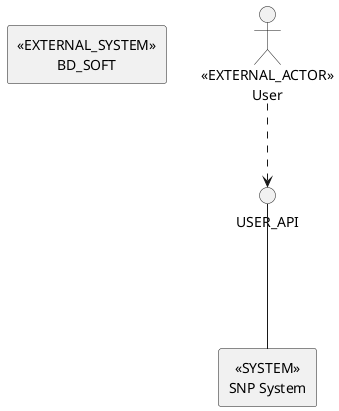
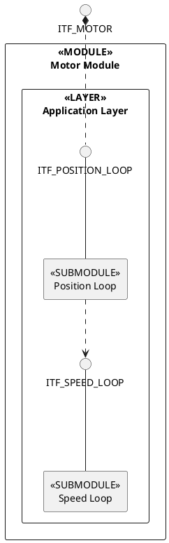

# sys-design CLI 系统设计说明书

## 1. 简介

sys-design 是一个用 Rust 编写的命令行工具，用于生成和验证架构图。采用接口驱动的设计理念，支持增量式编辑架构模型，并生成 PlantUML 格式的图表。

### 1.1 核心特性

- **三种图类型支持**：
  - **Context Diagram**：上下文图，系统作为黑盒与外部的交互
  - **Logic Architecture Concept Model**：逻辑架构概念模型，定义层次结构规则
  - **Logic View**：逻辑视图，具体实现，必须遵循概念模型
- **Workspace 支持**：多个图可定义在同一个 YAML 文件中
- **接口驱动设计**：系统定义接口 → 角色使用接口 → 自动推导关系
- **增量式编辑**：通过 CLI 命令逐步构建架构模型
- **YAML 存储**：人类可读的架构定义格式
- **PlantUML 输出**：生成符合模板格式的 PlantUML 图
- **层次结构验证**：Logic View 必须符合 Concept Model 定义的层次规则

### 1.2 三种图的关系

```
┌────────────────────────────────────────────────────────────────────┐
│                         Architecture Design                         │
├────────────────────────────────────────────────────────────────────┤
│                                                                     │
│  ┌─────────────────┐                                               │
│  │  Context Diagram │  ← 系统黑盒视图（外部交互）                    │
│  └─────────────────┘                                               │
│           │                                                         │
│           │ 定义系统边界                                             │
│           ▼                                                         │
│  ┌─────────────────────────────────────┐                           │
│  │  Logic Architecture Concept Model   │  ← 定义层次结构规则（Schema）│
│  │  ┌─────────────────────────────┐   │                           │
│  │  │ SYSTEM → SUBSYSTEM/COMPONENT│   │                           │
│  │  │ COMPONENT → LAYER           │   │                           │
│  │  │ LAYER → SUBMODULE           │   │                           │
│  │  │ SUBMODULE → SUBMODULE (递归) │   │                           │
│  │  └─────────────────────────────┘   │                           │
│  └─────────────────────────────────────┘                           │
│           │                                                         │
│           │ 约束                                                     │
│           ▼                                                         │
│  ┌─────────────────┐                                               │
│  │   Logic View    │  ← 具体实现（必须遵循 Concept Model）           │
│  │  ┌───────────┐  │                                               │
│  │  │ System    │  │                                               │
│  │  │  ├─ Motor │  │                                               │
│  │  │  │  └─ Layers │                                              │
│  │  │  │     └─ Submodules │                                       │
│  │  └───────────┘  │                                               │
│  └─────────────────┘                                               │
│                                                                     │
│  验证规则：Logic View 的层次结构必须符合 Concept Model 的定义        │
│                                                                     │
└────────────────────────────────────────────────────────────────────┘
```

**图类型说明：**

| 图类型 | 用途 | 类比 |
|--------|------|------|
| **Context Diagram** | 系统作为黑盒，展示与外部系统/用户的交互 | 系统外部视图 |
| **Logic Architecture Concept Model** | 定义允许的层次结构规则 | 数据库 Schema |
| **Logic View** | 具体的逻辑实现，展示模块、层级、接口、依赖 | 数据（必须符合 Schema）|

---

## 2. 概念模型

### 2.1 Context Diagram（上下文图）

```
┌─────────────────────────────────────────────────────────┐
│                    Context Diagram                       │
├─────────────────────────────────────────────────────────┤
│                                                          │
│  ┌──────────┐    provides    ┌────────────┐             │
│  │  System  │ ──────────────>│ Interface  │             │
│  └──────────┘                └────────────┘             │
│       │                            │                     │
│       │ uses                       │ uses                │
│       ▼                            ▼                     │
│  ┌──────────┐                ┌────────────┐             │
│  │  Actor   │ ──────────────>│ External   │             │
│  └──────────┘    uses        │  System    │             │
│                               └────────────┘             │
│                                                          │
└─────────────────────────────────────────────────────────┘
```

**元素定义：**

| 元素 | 说明 |
|------|------|
| **System** | 核心系统，有且仅有一个 |
| **Actor** | 外部角色（用户），分为 external 和 internal |
| **ExternalSystem** | 外部系统 |
| **Interface** | 接口定义，包含协议和端点 |
| **InterfaceProvider** | 系统提供的接口 |
| **InterfaceUsage** | 角色使用的接口 |
| **DerivedRelationship** | 推导出的关系 |

### 2.2 Logic Concept Diagram（逻辑架构概念模型图）

```
┌─────────────────────────────────────────────────────────┐
│                  Logic Concept Diagram                   │
├─────────────────────────────────────────────────────────┤
│                                                          │
│  ┌──────────┐    contains    ┌────────────┐             │
│  │  System  │ ──o..─────────>│ Subsystem  │             │
│  └──────────┘                └────────────┘             │
│       │                            │                     │
│       │ contains                   │ contains            │
│       ▼                            ▼                     │
│  ┌──────────┐                ┌────────────┐             │
│  │Component │ ──o..─────────>│   Layer    │             │
│  └──────────┘                └────────────┘             │
│                                    │                     │
│                                    │ contains            │
│                                    ▼                     │
│                               ┌────────────┐             │
│                               │ Submodule  │             │
│                               └────────────┘             │
│                                    │                     │
│                                    │ recursive           │
│                                    ▼                     │
│                               ┌────────────┐             │
│                               │ Submodule  │             │
│                               └────────────┘             │
│                                                          │
│  ┌──────────┐   uses        ┌────────────┐              │
│  │Submodule │ ───────────> │ Interface  │              │
│  └──────────┘               └────────────┘              │
│                                                          │
└─────────────────────────────────────────────────────────┘
```

**元素定义：**

| 元素 | 说明 |
|------|------|
| **System** | 根系统，有且仅有一个 |
| **Subsystem** | 子系统，可包含多个 Component |
| **Component** | 组件，包含多个 Layer |
| **Layer** | 层级，如应用层、服务层、数据层等 |
| **Submodule** | 子模块，可递归嵌套，包含接口和依赖 |
| **Interface** | 接口定义，属于 Submodule |
| **Dependency** | 依赖关系，Submodule 使用的 Interface |

**嵌套结构：**

```
System → Subsystem → Component → Layer → Submodule (递归) → Interface
```

**PlantUML 表示：**

```
rectangle "<<MODULE>>\nComponentName" as COMPONENT_ID {
    rectangle "<<LAYER>>\nLayerName" as LAYER_ID {
        interface INTERFACE_ID
        rectangle "<<SUBMODULE>>\nSubmoduleName" as SUBMODULE_ID
        INTERFACE_ID --- SUBMODULE_ID
        SUBMODULE_ID ..> DEPENDENCY_INTERFACE_ID
    }
}
```

---

## 3. 架构设计

### 3.1 分层架构

```
┌─────────────────────────────────────────────────────┐
│                      CLI Layer                       │
│  (args.rs, commands/context_model, generate, etc.)  │
├─────────────────────────────────────────────────────┤
│                    Application Layer                 │
│           (store/operations, validator)             │
├─────────────────────────────────────────────────────┤
│                      Domain Layer                    │
│         (model/c4, model/logic, workspace)          │
├─────────────────────────────────────────────────────┤
│                   Infrastructure Layer               │
│          (store/yaml_store, generator/plantuml)     │
└─────────────────────────────────────────────────────┘
```

### 3.2 模块职责

| 模块 | 职责 |
|------|------|
| `cli/args` | CLI 参数定义（clap），包括 DiagramType 枚举 |
| `cli/commands` | 子命令实现 |
| `model/c4` | Context Diagram 数据模型 |
| `model/logic` | Logic Concept Diagram 数据模型 |
| `model/workspace` | Workspace 容器（多图支持） |
| `store` | YAML 文件读写、CRUD 操作 |
| `validator` | 三类验证规则 |
| `generator` | PlantUML 生成（context, logic_concept） |
| `utils` | 错误类型定义 |

---

## 4. 数据模型

### 4.1 Workspace YAML Schema

支持在同一个文件中定义多个图：

```yaml
version: "1.0"
metadata:
  title: "项目架构文档"
  description: "完整的系统架构定义"
  created_at: 1711234567
  updated_at: 1711234567

context_diagram:
  version: "1.0"
  kind: context_diagram
  metadata:
    title: "系统上下文图"
    created_at: 1711234567
    updated_at: 1711234567
  system:
    id: "SNP_SYS"
    name: "SNP System"
    description: "核心系统"
  actors:
    - id: "end-user"
      name: "终端用户"
      type: "external"
  external_systems:
    - id: "BD_SOFT"
      name: "BD Soft"
      technology: "REST API"
  interfaces:
    - id: "USER_API"
      name: "User API"
      protocol: "rest"
  interface_providers:
    - system: "SNP_SYS"
      interfaces: ["USER_API"]
  interface_usages:
    - actor: "end-user"
      interfaces: ["USER_API"]

logic_concept_diagram:
  version: "1.0"
  kind: logic_concept_diagram
  metadata:
    title: "逻辑架构图"
    created_at: 1711234567
    updated_at: 1711234567
  system:
    id: "SNP_SYS"
    name: "SNP System"
    subsystems:
      - id: "DATA_PLANE"
        name: "Data Plane"
        components:
          - id: "DATA_COLLECTOR"
            name: "Data Collector"
            modules:
              - id: "COLLECTOR_CORE"
                name: "Collector Core"
                submodules: []
    components:
      - id: "API_GATEWAY"
        name: "API Gateway"
        modules: []
```

### 4.2 命名规范

| 元素类型 | 命名规范 | 示例 |
|----------|----------|------|
| system.id | UPPER_SNAKE_CASE | `SNP_SYS`, `PAYMENT_SERVICE` |
| external_systems.id | UPPER_SNAKE_CASE | `BD_SOFT`, `EXTERNAL_DB` |
| interfaces.id | UPPER_SNAKE_CASE | `USER_API`, `PAYMENT_INTERFACE` |
| actors.id | kebab-case | `end-user`, `system-admin` |
| subsystem/component/module/submodule.id | UPPER_SNAKE_CASE | `DATA_PLANE`, `API_GATEWAY` |

---

## 5. CLI 命令设计

### 5.1 命令结构

```
sys-design
├── context-model -s <file>
│   ├── add
│   │   ├── system <id> [--name] [--desc]
│   │   ├── actor <id> [--name] [--type]
│   │   ├── external-system <id> [--name] [--tech]
│   │   ├── interface <id> [--name] [--protocol]
│   │   ├── provide-relation <system> <interface>
│   │   └── interface-usage <actor> <interface>
│   ├── remove ...
│   ├── list <system|actors|external-systems|interfaces|relations>
│   └── show <id>
├── logic-model -s <file>
│   ├── add
│   │   ├── system <id> [--name] [--desc]
│   │   ├── subsystem <id> [--name] [--desc]
│   │   ├── component <id> [--name] [--desc] [--subsystem]
│   │   ├── layer <component_id> <id> [--name] [--desc]
│   │   ├── submodule <component_id> <layer_id> <id> [--name] [--desc] [--parent]
│   │   ├── interface <component_id> <layer_id> <submodule_id> <id> [--name] [--desc]
│   │   ├── dependency <component_id> <layer_id> <submodule_id> <interface_id>
│   │   └── expose <component_id> <interface_id>
│   ├── remove
│   │   ├── subsystem <id>
│   │   ├── component <id>
│   │   ├── layer <component_id> <id>
│   │   ├── submodule <component_id> <layer_id> <id>
│   │   ├── interface <component_id> <layer_id> <submodule_id> <id>
│   │   └── dependency <component_id> <layer_id> <submodule_id> <interface_id>
│   ├── list <system|subsystems|components|layers|submodules|interfaces|dependencies>
│   └── show <id>
├── generate -s <file> -t <type> [-o output.puml]
│   # -t, --type: context | logic-concept (default: context)
└── validate -s <file> -t <type>
    # -t, --type: context | logic-concept (default: context)
```

### 5.2 典型工作流

#### Context Diagram 工作流

```bash
# 创建新的 Context Diagram
sys-design context-model -s context.yaml add system SNP_SYS -n "SNP System"
sys-design context-model -s context.yaml add actor end-user -n "终端用户"
sys-design context-model -s context.yaml add interface USER_API -n "User API"
sys-design context-model -s context.yaml add provide-relation SNP_SYS USER_API
sys-design context-model -s context.yaml add interface-usage end-user USER_API

# 验证并生成
sys-design validate -s context.yaml -t context
sys-design generate -s context.yaml -t context -o context.puml
```

#### Logic Concept Diagram 工作流

```bash
# 创建新的 Logic Concept Diagram
sys-design logic-model -s logic.yaml add system MY_SYSTEM -n "My System"
sys-design logic-model -s logic.yaml add component MOTOR -n "Motor Module"
sys-design logic-model -s logic.yaml add layer MOTOR APP_LAYER -n "Application Layer"
sys-design logic-model -s logic.yaml add submodule MOTOR APP_LAYER POSITION_LOOP -n "Position Loop"
sys-design logic-model -s logic.yaml add submodule MOTOR APP_LAYER SPEED_LOOP -n "Speed Loop"
sys-design logic-model -s logic.yaml add interface MOTOR APP_LAYER SPEED_LOOP ITF_SPEED_LOOP -n "Speed Loop Interface"
sys-design logic-model -s logic.yaml add interface MOTOR APP_LAYER POSITION_LOOP ITF_POSITION_LOOP -n "Position Loop Interface"
sys-design logic-model -s logic.yaml add dependency MOTOR APP_LAYER POSITION_LOOP ITF_SPEED_LOOP

# 验证并生成
sys-design validate -s logic.yaml -t logic-concept
sys-design generate -s logic.yaml -t logic-concept -o logic.puml
```

#### 添加嵌套子模块

```bash
# 添加嵌套的子模块
sys-design logic-model -s logic.yaml add submodule MOTOR APP_LAYER CONTROL_UNIT -n "Control Unit"
sys-design logic-model -s logic.yaml add submodule MOTOR APP_LAYER POSITION_LOOP --parent CONTROL_UNIT -n "Nested Position Loop"
```

---

## 6. 验证规则

### 6.1 Context Diagram 验证

**完整性检查 (Completeness)：**

| 代码 | 规则 | 严重性 |
|------|------|--------|
| C001 | 系统 ID/Name 不能为空 | Error |
| C002 | Actor 必填字段检查 | Error |
| C003 | ExternalSystem 必填字段检查 | Error |

**一致性检查 (Consistency)：**

| 代码 | 规则 | 严重性 |
|------|------|--------|
| S001 | 所有元素 ID 必须唯一 | Error |
| S002 | 孤立接口检查 | Warning |
| S003 | 孤立 Actor/System 检查 | Warning |

**命名规范检查 (Naming)：**

| 代码 | 规则 | 严重性 |
|------|------|--------|
| N001 | ID 命名格式检查 | Warning |
| N002 | 名称长度不超过 50 字符 | Info |
| N003 | 保留字检查 | Error |

### 6.2 Logic Concept Diagram 验证

- 所有元素 ID 使用 UPPER_SNAKE_CASE 格式
- 嵌套结构的 ID 唯一性检查
- 非空 ID 检查

---

## 7. PlantUML 生成

### 7.1 Context Diagram 输出



**元素映射：**

| YAML 元素 | PlantUML 语法 |
|-----------|---------------|
| System | `rectangle "<<SYSTEM>>\n名称" as ID` |
| Actor (external) | `actor "<<EXTERNAL_ACTOR>>\n名称" as ID` |
| Actor (internal) | `actor "<<INTERNAL_ACTOR>>\n名称" as ID` |
| ExternalSystem | `rectangle "<<EXTERNAL_SYSTEM>>\n名称" as ID` |
| Interface | `interface ID` |
| 使用关系 | `USER ..> INTERFACE` |
| 提供关系 | `INTERFACE --- SYSTEM` |

### 7.2 Logic Concept Diagram 输出



**元素映射：**

| YAML 元素 | PlantUML 语法 |
|-----------|---------------|
| Component | `rectangle "<<MODULE>>\n名称" as ID { ... }` |
| Layer | `rectangle "<<LAYER>>\n名称" as ID { ... }` |
| Submodule | `rectangle "<<SUBMODULE>>\n名称" as ID` |
| Interface | `interface ID` |
| 接口归属 | `INTERFACE --- SUBMODULE` |
| 依赖关系 | `SUBMODULE ..> INTERFACE` |
| 暴露接口 | `COMPONENT_ID *.. INTERFACE_ID` |

---

## 8. 项目结构

```
sys-design-cli/
├── code/                          # Rust 代码
│   ├── Cargo.toml
│   ├── src/
│   │   ├── main.rs               # CLI 入口
│   │   ├── lib.rs                # 库入口
│   │   ├── cli/                  # CLI 模块
│   │   │   ├── args.rs           # 参数定义（含 DiagramType）
│   │   │   └── commands/         # 子命令
│   │   │       ├── context_model.rs  # Context Diagram 操作
│   │   │       ├── logic_model.rs    # Logic Concept Diagram 操作
│   │   │       ├── generate.rs       # PlantUML 生成
│   │   │       └── validate.rs       # 模型验证
│   │   ├── model/                # 数据模型
│   │   │   ├── c4/context.rs     # Context Diagram
│   │   │   ├── logic/concept.rs  # Logic Concept Diagram
│   │   │   └── workspace.rs      # Workspace 容器
│   │   ├── store/                # 存储层
│   │   │   ├── yaml_store.rs     # YAML 读写（支持 Workspace）
│   │   │   ├── operations.rs     # Context Diagram CRUD 操作
│   │   │   └── logic_operations.rs # Logic Concept CRUD 操作
│   │   ├── validator/            # 验证器
│   │   │   ├── mod.rs            # 入口
│   │   │   ├── result.rs         # 验证结果
│   │   │   ├── rules/            # Context 验证规则
│   │   │   └── logic_concept.rs  # Logic Concept 验证
│   │   ├── generator/plantuml/   # 生成器
│   │   │   ├── context.rs        # Context 生成
│   │   │   └── logic_concept.rs  # Logic Concept 生成
│   │   └── utils/                # 工具
│   └── tests/                    # 集成测试
├── scripts/                       # 运行脚本
│   ├── build.sh                  # 构建
│   ├── release.sh                # 发布构建（输出到 output/）
│   ├── test.sh                   # 测试
│   ├── run.sh                    # 运行
│   └── clean.sh                  # 清理
├── output/                        # 发布输出目录
│   └── windows-x86-64/           # Windows x64 发布包
├── doc/                          # 文档
└── template/                     # 架构模板
    ├── context-diagram.md        # Context 图模板
    └── logic-view.md             # Logic Concept 图模板
```

---

## 9. 技术选型

| 依赖 | 版本 | 用途 |
|------|------|------|
| clap | 4.5 | CLI 参数解析（derive 模式） |
| serde | 1.0 | 序列化框架 |
| serde_yaml | 0.9 | YAML 序列化 |
| serde_json | 1.0 | JSON 输出支持 |
| thiserror | 1.0 | 错误定义 |
| anyhow | 1.0 | 错误处理 |
| regex | 1.10 | 命名验证 |
| colored | 2.1 | 终端着色 |
| chrono | 0.4 | 时间处理 |

---

## 10. 扩展性设计

### 10.1 已实现

- ✅ Context Diagram（C4 Context 层）
- ✅ Logic Concept Diagram（逻辑架构概念模型）
- ✅ Workspace（多图支持）

### 10.2 预留扩展点

- **C4 Container 层**：`model/c4/container.rs`（预留）
- **C4 Component 层**：`model/c4/component.rs`（预留）
- **4+1 视图**：`model/four_plus_one/`（预留）

### 10.3 4+1 视图扩展

```
4+1 视图模型:
├── logical_view      # 逻辑视图：功能模块
├── process_view      # 进程视图：并发和分布
├── development_view  # 开发视图：程序结构
├── physical_view     # 物理视图：部署拓扑
└── scenarios         # 用例视图：场景描述
```

---

## 11. 测试覆盖

### 11.1 单元测试

- 模型创建测试（Context, LogicConcept, Workspace）
- 关系推导测试
- YAML 序列化测试
- 验证规则测试（Context, LogicConcept）
- PlantUML 生成测试（Context, LogicConcept）

### 11.2 集成测试

- 基础命令测试
- Add 命令测试
- List 命令测试
- Generate 命令测试（多图类型）
- Validate 命令测试（多图类型）
- Remove 命令测试

---

## 12. 发布构建

### 12.1 构建命令

```bash
# 构建发布包
./scripts/release.sh [target]

# target 参数：
#   windows-x86-64  (默认)
```

### 12.2 输出结构

```
output/
└── windows-x86-64/
    ├── sys-design.exe    # 可执行文件
    ├── README.md         # 说明文档
    ├── LICENSE           # 许可证
    └── template/         # 模板目录
```

---

## 13. 参考资料

- [C4 Model](https://c4model.com/) - Simon Brown
- [PlantUML](https://plantuml.com/) - UML 图生成工具
- [The 4+1 View Model of Architecture](https://www.cs.ubc.ca/~gregor/teaching/papers/4+1view-architecture.pdf) - Philippe Kruchten
