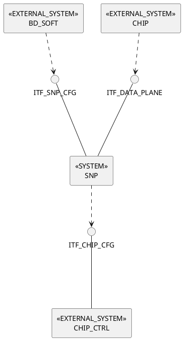

# 上下文图模板

```plantuml
@startuml

skinparam defaultTextAlignment center

rectangle "<<EXTERNAL_SYSTEM>>\nBD_SOFT" as BD_SOFT
rectangle "<<EXTERNAL_SYSTEM>>\nCHIP" as CHIP

interface ITF_SNP_CFG
interface ITF_DATA_PLANE
rectangle "<<SYSTEM>>\nSNP" as SNP

interface ITF_CHIP_CFG
rectangle "<<EXTERNAL_SYSTEM>>\nCHIP_CTRL" as CHIP_CTRL

BD_SOFT ..> ITF_SNP_CFG
CHIP ..> ITF_DATA_PLANE

ITF_SNP_CFG --- SNP
ITF_DATA_PLANE --- SNP

SNP ..> ITF_CHIP_CFG
ITF_CHIP_CFG --- CHIP_CTRL

@enduml
```
