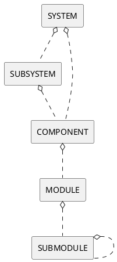

# 逻辑架构概念模型图

```plantuml
@startuml

skinparam defaultTextAlignment center

rectangle SYSTEM
rectangle SUBSYSTEM
rectangle COMPONENT
rectangle MODULE
rectangle SUBMODULE

SYSTEM o.. SUBSYSTEM
SUBSYSTEM o.. COMPONENT
SYSTEM o.. COMPONENT
COMPONENT o.. MODULE
MODULE o.. SUBMODULE
SUBMODULE o.. SUBMODULE


@enduml
```
