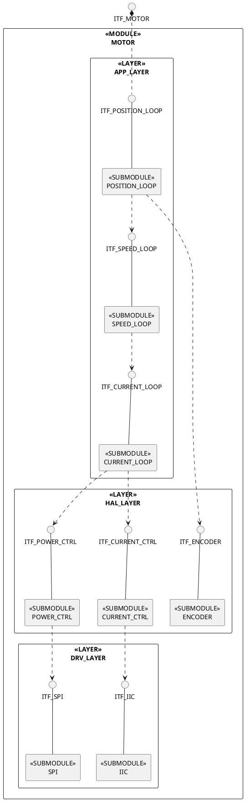

# 逻辑视图

```plantuml
@startuml

top to bottom direction
skinparam defaultTextAlignment center

interface ITF_MOTOR

rectangle "<<MODULE>>\nMOTOR" as MOTOR {

    rectangle "<<LAYER>>\nAPP_LAYER" as APP_LAYER {

        interface ITF_POSITION_LOOP
        rectangle "<<SUBMODULE>>\nPOSITION_LOOP" as POSITION_LOOP

        interface ITF_SPEED_LOOP
        rectangle "<<SUBMODULE>>\nSPEED_LOOP" as SPEED_LOOP

        interface ITF_CURRENT_LOOP
        rectangle "<<SUBMODULE>>\nCURRENT_LOOP" as CURRENT_LOOP

        ITF_POSITION_LOOP --- POSITION_LOOP
        ITF_SPEED_LOOP --- SPEED_LOOP
        ITF_CURRENT_LOOP --- CURRENT_LOOP

        POSITION_LOOP ..> ITF_SPEED_LOOP
        SPEED_LOOP ..> ITF_CURRENT_LOOP

    }

    rectangle "<<LAYER>>\nHAL_LAYER" as HAL_LAYER {

        interface ITF_ENCODER
        rectangle "<<SUBMODULE>>\nENCODER" as ENCODER

        interface ITF_CURRENT_CTRL
        rectangle "<<SUBMODULE>>\nCURRENT_CTRL" as CURRENT_CTRL

        interface ITF_POWER_CTRL
        rectangle "<<SUBMODULE>>\nPOWER_CTRL" as POWER_CTRL

        ITF_ENCODER --- ENCODER
        ITF_CURRENT_CTRL --- CURRENT_CTRL
        ITF_POWER_CTRL --- POWER_CTRL

    }

    rectangle "<<LAYER>>\nDRV_LAYER" as DRV_LAYER {

        interface ITF_IIC
        rectangle "<<SUBMODULE>>\nIIC" as IIC

        interface ITF_SPI
        rectangle "<<SUBMODULE>>\nSPI" as SPI

        ITF_IIC --- IIC
        ITF_SPI --- SPI
    }

    POSITION_LOOP ..> ITF_ENCODER
    CURRENT_LOOP ..> ITF_CURRENT_CTRL
    CURRENT_LOOP ..> ITF_POWER_CTRL
    POWER_CTRL ..> ITF_SPI
    CURRENT_CTRL ..> ITF_IIC

}

ITF_MOTOR *.. ITF_POSITION_LOOP

@enduml
```
